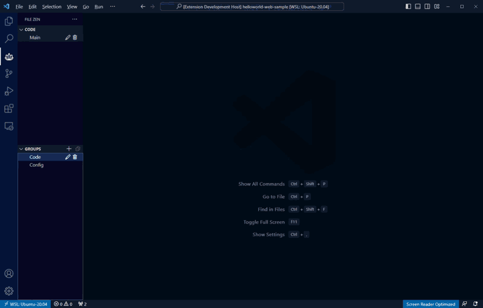
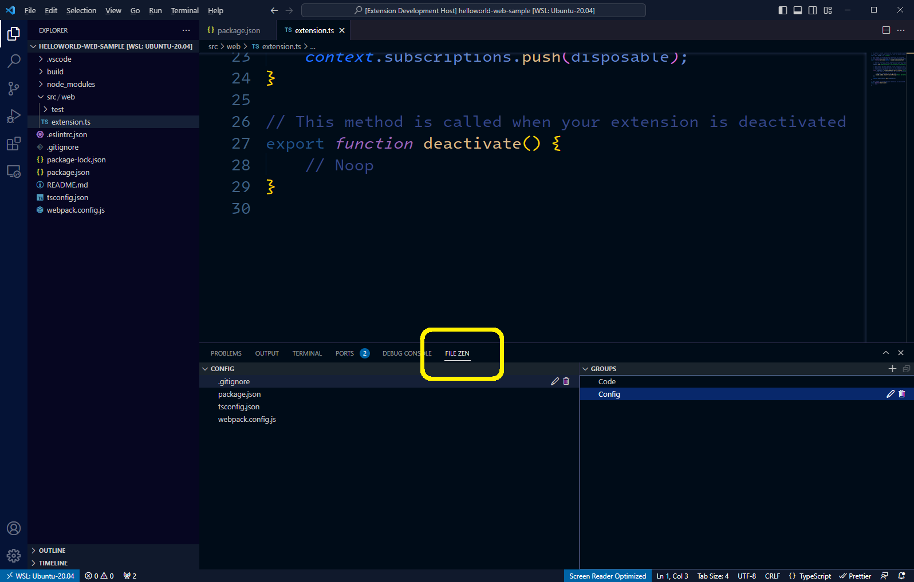
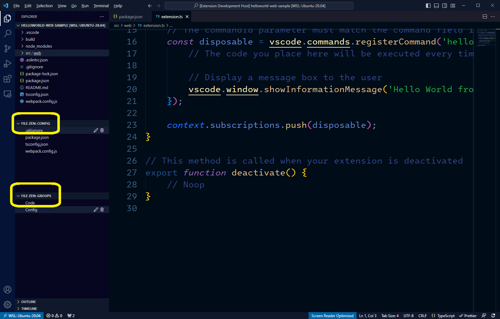

# File Zen

File Zen is an extension that lets you create lists of related files to more easily navigate large projects. This allows you to focus on just the files that matter for a given task or feature without having to continually scroll through the Explorer tree.

## Features

### Adding Files

- Add or remove files to a list via editor context menus
- Toggle the currently open file using the Toggle keyboard shortcut
  - <kbd>Ctrl+Alt+N</kbd> (Windows)
  - <kbd>⌥⌘N</kbd> (Mac)
- Give the file a label for easier identification

### File Groups

- Add groups to keep separate lists of related files
- Easily switch between groups related to specific features or frequently accessed files

### View Flexibility

Drag and drop File Zen views to different parts of the VS Code UI. This makes it easy to access your lists while working alongside the main Explorer view.

## Known Issues

- Need to detect when files are renamed, moved, or deleted
- Would be nice to have file type icons in list
- Needs more flexible sorting/ordering
- Need to add languages other than English

## Release Notes

### 1.0.0

Initial release
